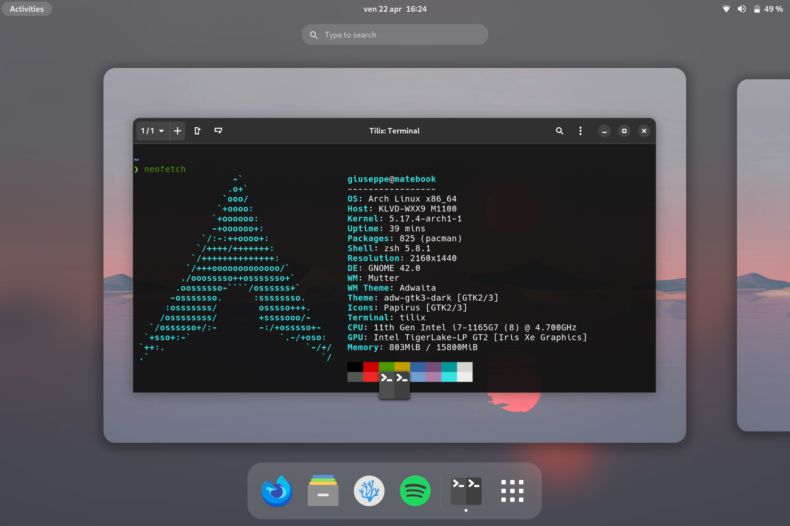

# My Matebook 14 (2021) configurations

<div align="center">
 
</div>
<br>
This configuration is used on ArchLinux with Gnome + Wayland (1-1 gestures & fractional scaling at 150%).<br>
It tries to maximize battery life: currently reaching 13/14 hours of normal use, mainly programming software (with the "battery care" set at 80%).<br>
Another goal is to try to keep a system theme as equal as possible among all applications.<br><br>

**N.B.**
- The files in `/boot/loader` are used for `systemd-boot` and **must** be edited
- The files in `/etc/sudoers.d/` uses my username, so should be edited
- The changes of `/etc/dconf/...` must be applied using `sudo dconf update`
- When the battery reaches `5%` the system goes into hibernation, this behavior can be changed in the `/etc/udev/rules.d/99-lowbat.rules` file

## Packages
  * [`adw-gtk3`](https://aur.archlinux.org/packages/adw-gtk3)
  * [`capitaine-cursors`](https://archlinux.org/packages/community/any/capitaine-cursors)
  * [`gdm-plymouth-nox`](https://aur.archlinux.org/packages/gdm-plymouth)
  * [`intel-media-driver`](https://archlinux.org/packages/community/x86_64/intel-media-driver)
  * [`intel-media-sdk`](https://archlinux.org/packages/community/x86_64/intel-media-sdk)
  * [`libva-utils`](https://archlinux.org/packages/community/x86_64/libva-utils)
  * [`libva-vdpau-driver`](https://archlinux.org/packages/extra/x86_64/libva-vdpau-driver)
  * [`linux-firmware`](https://archlinux.org/packages/core/any/linux-firmware)
  * [`nerd-fonts-hack`](https://aur.archlinux.org/packages/nerd-fonts-hack)
  * [`noto-fonts-emoji`](https://archlinux.org/packages/extra/any/noto-fonts-emoji)
  * [`pacman-contrib`](https://archlinux.org/packages/community/x86_64/pacman-contrib)
  * [`papirus-icon-theme`](https://archlinux.org/packages/community/any/papirus-icon-theme)
  * [`plymouth`](https://aur.archlinux.org/packages/plymouth)
  * [`powertop`](https://archlinux.org/packages/community/x86_64/powertop)
  * [`reflector`](https://archlinux.org/packages/community/any/reflector)
  * [`starship`](https://archlinux.org/packages/community/x86_64/starship)
  * [`thermald`](https://archlinux.org/packages/community/x86_64/thermald)
  * [`tlp`](https://archlinux.org/packages/community/any/tlp)
  * [`toolbox`](https://archlinux.org/packages/community/x86_64/toolbox)
  * [`util-linux`](https://archlinux.org/packages/core/x86_64/util-linux)
  * [`vdpauinfo`](https://archlinux.org/packages/community/x86_64/vdpauinfo)
  * [`vulkan-intel`](https://archlinux.org/packages/extra/x86_64/vulkan-intel)
  * [`xorg-xwayland-hidpi-git`](https://aur.archlinux.org/packages/xorg-xwayland-hidpi-git)
  * [`zsh`](https://archlinux.org/packages/extra/x86_64/zsh)
  * [`zsh-autosuggestions`](https://archlinux.org/packages/community/any/zsh-autosuggestions)
  * [`zsh-syntax-highlighting`](https://archlinux.org/packages/community/any/zsh-syntax-highlighting)

```
$ yay -S adw-gtk3 capitaine-cursors gdm-plymouth-nox intel-media-driver intel-media-sdk libva-utils libva-vdpau-driver linux-firmware nerd-fonts-hack noto-fonts-emoji papirus-icon-theme pacman-contrib plymouth powertop reflector starship thermald tlp toolbox util-linux vdpauinfo vulkan-intel xorg-xwayland-hidpi-git zsh zsh-autosuggestions zsh-syntax-highlighting
```

## Service(s) & Timer(s)
  * [`fstrim.timer`](https://wiki.archlinux.org/title/Solid_state_drive#TRIM) (Requires _util-linux_ package)
  * [`thermald.service`](https://wiki.archlinux.org/title/CPU_frequency_scaling#thermald) (Requires _thermald_ package)
  * [`tlp.service`](https://wiki.archlinux.org/title/TLP) (Requires _tlp_ package)

```
$ sudo systemctl enable --now fstrim.timer thermald.service tlp.service
```

## See also
- [giuseppe998e/GDM Fractional Scaling](https://gist.github.com/giuseppe998e/76127934e9bdc4bac45ebebcbd8e7954)
- [LarryIsBetter/Linux Laptop Optimizations](https://gist.github.com/LarryIsBetter/218fda4358565c431ba0e831665af3d1)
